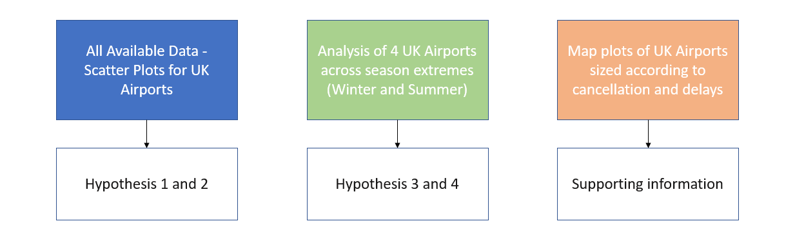
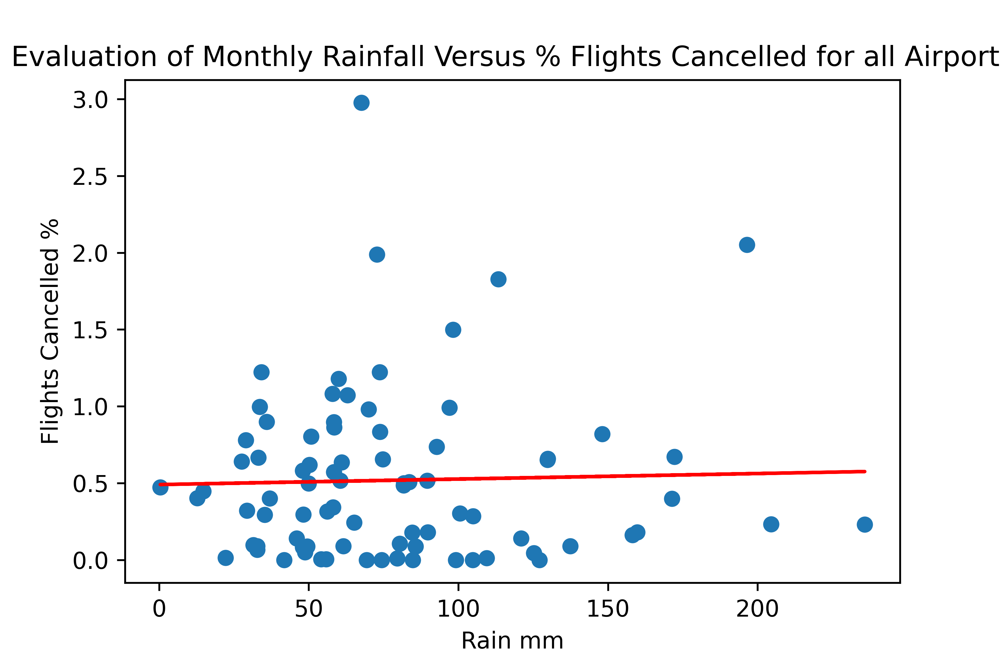
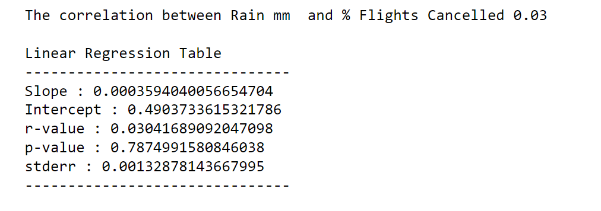
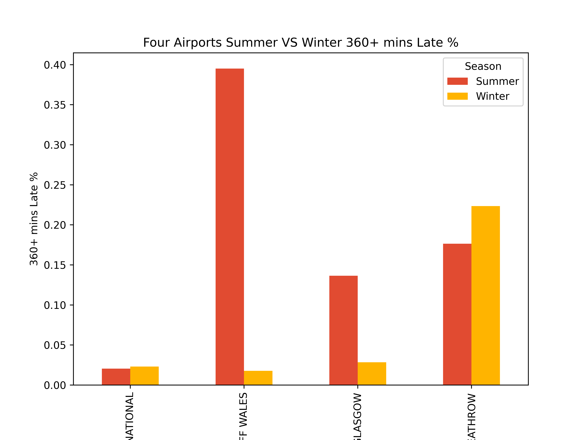
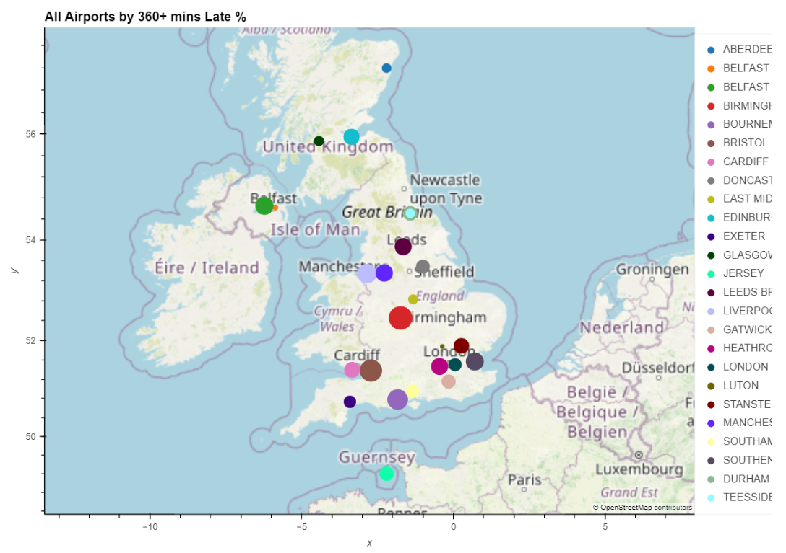

# Project_1_Sand

## Project Week 1 

# Topic: Data Investigation into the Effect of Weather on Flight Disruption at UK Airports

## File Structure:
    Project_1_Sand
        output
        resources
        presentation
        analysis.ipynb
        data_prep.ipynb
        README.md

## Dependencies:
    1. Modules:
        The following modules were imported
            import re
            import os
            import urllib
    
            import hvplot.pandas
            import pandas as pd
            import numpy as np
            import requests
            import scipy.stats as st
    
            from datetime import datetime
            import datetime as dt
            import matplotlib.pyplot as plt
            from meteostat import Point, Daily, Monthly, Stations
    
            #Turn off warning messages
            import warnings
            warnings.filterwarnings("ignore")

    2. Local dependencies:
            #Import API from "geoapify.py" key which is ignored by gitignore.
            from api_keys import geoapify_key

## Dataset sources:
1. Airport Punctuality Data (24 .csv files)
    * Data Collected:
        * Punctuality statistics 2018 (January to December).
        * Punctuality statistics 2019 (January to December).
    * Source:
        * [caa.co.uk](https://www.caa.co.uk/)
            * Civil Aviation Authority => Flight punctuality => [UK flight punctuality statistics](https://www.caa.co.uk/data-and-analysis/uk-aviation-market/flight-punctuality/uk-flight-punctuality-statistics/)

2. Weather 1 Data (4 .txt links)
    * Data Collected:
        * Historic station data of all 4 airports
            * https://www.metoffice.gov.uk/pub/data/weather/uk/climate/stationdata/armaghdata.txt
            * https://www.metoffice.gov.uk/pub/data/weather/uk/climate/stationdata/cardiffdata.txt
            * https://www.metoffice.gov.uk/pub/data/weather/uk/climate/stationdata/paisleydata.txt
            * https://www.metoffice.gov.uk/pub/data/weather/uk/climate/stationdata/heathrowdata.txt
    * Source:
        * www.metoffice.gov.uk
            * Climate => UK Climate => [Historic station data](https://www.metoffice.gov.uk/research/climate/maps-and-data/historic-station-data)

3. Weather 2 Data (Meteostat Python library and API)
    * Data Collected:
        * Nearest Weather station to all 4 airports data
        Grabbed the WMO code which was subsequently used to get the historic weather data for each airport
    * Source:
        * [dev.meteostat.net](https://dev.meteostat.net/)

**Two data sources for weather were used as average temperature column in the first data source had a lot of invalid values.**

## Data cleaning
1. Merging Airport Punctuality Data:
    * All 24 Files were dynamically converted into dataframes, appended into a list and subsequently joined together.
    * The dataframe was exported as follows; 
        * “airport_punctuality_data.to_csv("Resources/converted_to_csv/airport_punctuality_data.csv", index=False, header=True)”

2. Merging Weather 1 Data:
    * Text files were read from source instead of downloading.
    * The data converted into a dataframe, cleaned and exported to a .csv format as follows:
        * "airport_weather1.to_csv("Resources/converted_to_csv/airport_weather1.csv", index=False, header=True)"

3. Merging Weather 2 Data:
    * Geoapify was used to grab the coordinates for each airport
    * Meteostat API was used in conjunction with the coordinate pairs to find the nearest weather stations of each of the 4 airports.
    * Subsequently, the "fetch()" method was called to get the weather dataframe for us.
    * The resulting dataframe was exported as follows:
        * "airport_weather2.to_csv("Resources/converted_to_csv/airport_weather2.csv", index=False, header=True)"

4. Merging all 3 dataframes:
    * All 3 dataframes were merged into a single dataframe "final_data" and exported as follows:
        * "final_data.to_csv("Resources/converted_to_csv/final_data.csv", index=False, header=True)"
        
## Limitations of the Datasets
The Datasets had a invalid and missingvalues whose entire rows were dropped entirely. Also, to satisfy the hypotheses, a lot of files and links were used from 3 different sources and even though they are trusted sources, the exact true story cannot be told.

## Analysis

### Running the Analysis
1. The file, “data_prep.ipynb” needs to be run first to be able to get all the “.csv” files exported and ready for analysis.
2. When the “analysis.ipynb” file is run, the four “.csv” files will be imported, converted into dataframes and used for the analysis.

### Hypotheses
1. Weather Conditions have an effect on Flight Cancellations Across UK Airports
2. Weather Conditions have an effect on Flight Delays Across UK Airports
3. Season Extremes have an effect on Flight Cancellations at Selected UK Airports
4. Season Extremes have an effect on Flight Delays at Selected UK Airports

#### Three Streams of Data Analysis

#### Methodology : 
Investigate 4 weather variables
(Av Monthly Rainfall / Wind Speed / Frost Days / Temperature) against  2 Flight Departure Conditions (Cancelled /Average Mins Late)

#### Examples : 

